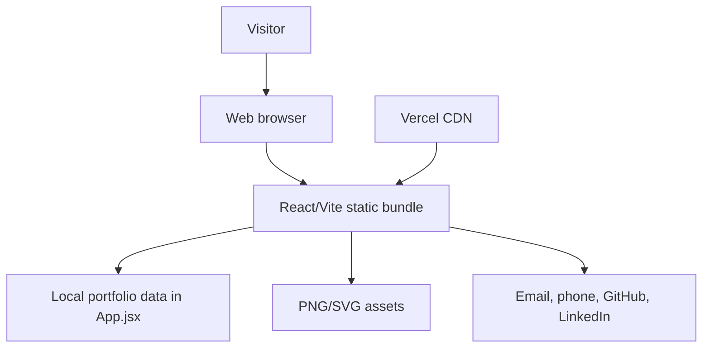
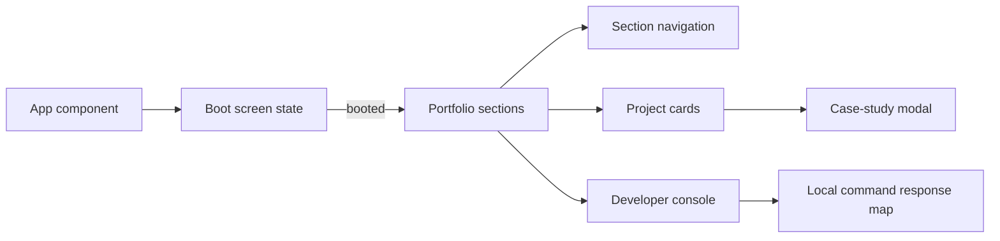
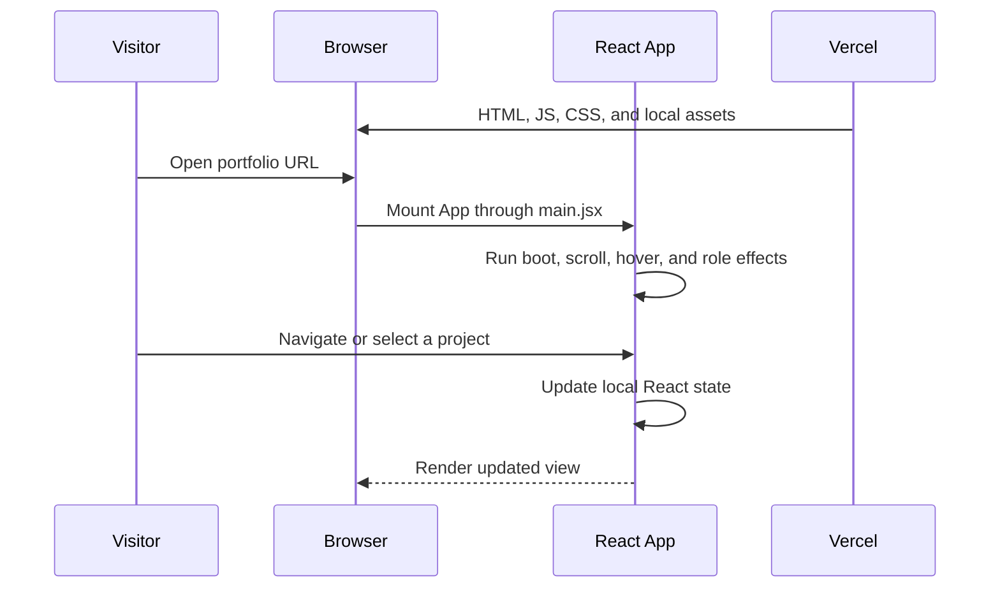
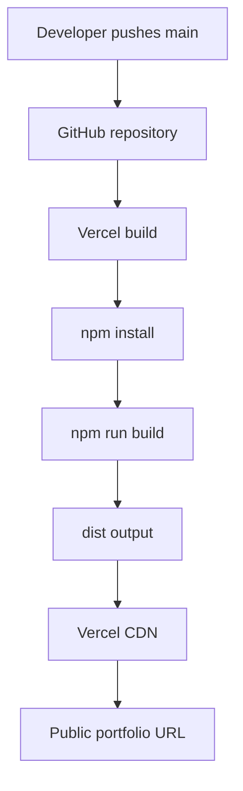

# Architecture

## Project Overview

Kuldeep Patil Portfolio is a static, single-page React application built with Vite. It presents profile information, work history, project case studies, technical skills, applied AI work, achievements, and contact links. There is no server runtime in this repository.

## High-Level Architecture



Vercel builds the repository with `npm run build`, serves the generated `dist` directory, and redeploys when changes reach the configured branch.

## Frontend Architecture

- **Framework:** React 19
- **Build system:** Vite 8 with `@vitejs/plugin-react`
- **Entry point:** `src/main.jsx` creates the React root and renders `App` inside `StrictMode`.
- **Main view:** `src/App.jsx` contains the complete single-page experience and local data arrays for projects and technology groups.
- **Styling:** `src/App.css` contains the portfolio layout, responsive rules, visual effects, and animations. `src/index.css` provides global defaults and font loading.
- **State:** React `useState` manages boot progress, selected project, terminal input/output, active navigation section, cursor position, role rotation, and hovered technology nodes.
- **Effects:** React `useEffect` manages boot timing, rotating roles, pointer tracking, and scroll-based active navigation. `useMemo` stores the stable role list.
- **Routing:** There is no router. Navigation uses section IDs and `scrollIntoView`.
- **Components:** The current implementation is a single `App` component with inline repeated view structures; there are no separate component files.
- **Services/API layer:** None. All displayed content is local, and no `fetch`, API client, or backend call exists.
- **Assets:** `src/assets/hero.png` is imported by the React bundle. `public/favicon.svg` and `public/icons.svg` are served as static public assets.

## Interaction Flow



The project modal opens from a card click and closes through the close button or backdrop. The developer console responds locally to `help`, `about`, `skills`, `projects`, `experience`, and `achievements`; unknown commands receive a local error message.

## Backend Architecture

No backend exists in this repository.

- No Node/Express server entry point
- No routes, controllers, services, middleware, or server-side validation
- No authentication or authorization
- No server-side error handling
- No API base URL or server environment variables

The project descriptions in the portfolio refer to other applications and do not represent backend code present here.

## Database Architecture

No database is connected to this application.

- No MongoDB, PostgreSQL, Firebase, or other database client is configured
- No collections, tables, models, migrations, or database relationships exist
- No persistent user data is stored by the portfolio

## API Architecture

There is no API in this repository. The only external actions are browser-handled links:

- `mailto:` opens an email client
- `tel:` opens a phone handler
- GitHub and LinkedIn links open external profiles in a new tab

## Authentication and Authorization

The site is publicly accessible and has no login, session, token, authentication, or authorization flow.

## Data Flow



No application data leaves the browser. Contact actions leave the site only when the visitor chooses an external link.

## Folder Structure

```text
portfolio/
├── public/
│   ├── favicon.svg
│   └── icons.svg
├── src/
│   ├── assets/
│   │   └── hero.png
│   ├── App.css
│   ├── App.jsx
│   ├── index.css
│   └── main.jsx
├── docs/
│   └── ARCHITECTURE.md
├── index.html
├── package.json
├── package-lock.json
├── vite.config.js
└── README.md
```

Generated `dist/` and installed `node_modules/` directories are intentionally ignored by Git.

## Deployment Architecture



Vite is configured with `base: '/'`, which matches the Vercel root deployment. Vercel should use the Vite preset, repository root `./`, build command `npm run build`, and output directory `dist`.

## Verification Boundary

The repository currently provides `npm run lint` and `npm run build`. There is no automated unit, integration, API, database, or end-to-end test suite because those layers are not part of the application.
